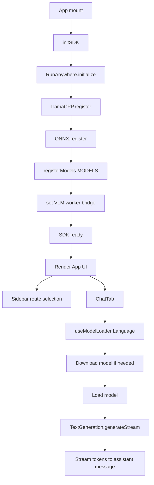

# RunAnywhere Web Starter App


DocuMentor is an offline, privacy-first document assistant that runs entirely in your browser.

It’s designed for real-world sensitive reading and writing workflows (insurance documents, policies, contracts, academic drafts, internal technical docs) where you don’t want to paste content into hosted AI tools. All AI runs on-device (WebAssembly/WebGPU where available) — no server-side inference and no API keys.

At a product level, DocuMentor focuses on three core experiences:

- Smart Highlights: automatically surface the most important sections from long documents so you can review faster.
- Guided Learning: turn your own notes/docs/tech documentation into structured, teach-card style explanations and simplified takeaways.
- Research: help you critique arguments and improve writing while keeping your drafts private (e.g., framing an abstract, strengthening points, and guiding a research-paper structure).

## Live Deployment

- Production URL: https://docu-mentor-woad.vercel.app

## Tech Stack

| Layer | Technology | Purpose |
|---|---|---|
| Frontend | React 19 + TypeScript | UI composition and state management |
| Build Tool | Vite 6 | Dev server, bundling, worker support |
| AI Core | `@runanywhere/web` | SDK init, model registry, model manager |
| LLM/VLM Backend | `@runanywhere/web-llamacpp` | Text generation and VLM worker bridge |
| ONNX Backend | `@runanywhere/web-onnx` | ONNX runtime backend registration |
| Deployment | Vercel | SPA hosting with required isolation headers |

## What the App Does Today

| Area | Behavior |
|---|---|
| SDK Startup | Initializes RunAnywhere, registers LlamaCPP + ONNX, registers model catalog |
| Navigation | Sidebar updates browser path (`/`, `/research`, `/dev`) and heading text |
| AI Chat | Streams assistant responses token-by-token with cancellation support |
| Model Loading UX | Banner-driven state machine: `idle -> downloading -> loading -> ready` or `error` |
| Runtime Badge | Shows active acceleration mode (`WebGPU` or `CPU`) |

## Recruiter Summary

If you’re reviewing this repo, here’s what I built and what it demonstrates:

| What | Why it matters |
|---|---|
| On-device AI chat in the browser | Shows I can integrate modern WASM/WebGPU AI runtimes without relying on hosted APIs |
| Streaming generation UX (token-by-token) | Demonstrates real-time UI updates, cancellation, and robust async state handling |
| Model lifecycle management | Handles download progress, load/unload states, retries, and caching via OPFS |
| Production-ready deployment constraints | Ships with correct Cross-Origin Isolation headers and WASM asset handling for real browsers |

In short: DocuMentor is a product-shaped shell for document-centric AI workflows, with a working on-device chat implementation and the scaffolding needed to expand into richer document analysis experiences.

## Feature Offerings (From Product Cards)

The product experience is organized around three user-facing feature tracks.

| Feature | Core Promise | UX Summary |
|---|---|---|
| Research | Challenge arguments and switch into writing help in one workspace | Thesis/debate workflow with critique-to-edit transitions |
| Guided Learning | Learn directly from your own notes/docs/code | Source-grounded teaching cards and session-aware memory |
| Smart Highlights | Surface the most important sections in long files | Document-analysis route for importance extraction and exportable highlights |

### Research

| Item | Description |
|---|---|
| Tagline | Challenge the argument |
| Main Value | Load a thesis, debate it, then move into writing help without leaving the chatbot workflow |
| UI Preview Intent | Prompt behavior shifts from critique mode to editing-assist mode |
| Capabilities | Counterarguments on demand; writing improvement mode; single chatbot route flow |

### Guided Learning

| Item | Description |
|---|---|
| Tagline | Learn from your own text |
| Main Value | Paste notes/docs/code and get a teaching-style workspace in the same app shell |
| UI Preview Intent | Input transforms into a source-aware teaching workspace |
| Capabilities | Teach selection or full source; session-aware local source memory; lesson cards grounded in user text |

### Smart Highlights

| Item | Description |
|---|---|
| Tagline | Surface the important parts |
| Main Value | Keep a dedicated document analysis flow for identifying high-value sections |
| UI Preview Intent | Dedicated route remains available for document review |
| Capabilities | PDF and DOCX ready; importance analysis; exportable highlights |

## Quick Start

```bash
npm install
npm run dev
```

Open `http://localhost:5173`.

For production build:

```bash
npm run build
npm run preview
```

## Source Walkthrough (`src/`)

### High-Level Tree

```text
src/
├── main.tsx
├── App.tsx
├── runanywhere.ts
├── components/
│   ├── ChatTab.tsx
│   ├── ModelBanner.tsx
│   └── Sidebar.tsx
├── hooks/
│   └── useModelLoader.ts
├── styles/
│   └── index.css
└── workers/
    └── vlm-worker.ts
```

### File-by-File Responsibilities

| File | Responsibility | Key Exports / Notes |
|---|---|---|
| `src/main.tsx` | React entry point and root render | Mounts `<App />` in `StrictMode` |
| `src/App.tsx` | Shell layout, SDK boot flow, route heading logic, tab host | `App` component; path-based heading resolver |
| `src/runanywhere.ts` | RunAnywhere initialization, backend registration, model catalog, VLM worker setup | `initSDK`, `getAccelerationMode`, re-exports SDK helpers |
| `src/components/ChatTab.tsx` | Chat conversation state, streaming generation, cancellation, metrics rendering | `ChatTab` |
| `src/components/ModelBanner.tsx` | Model status/CTA banner for download/load/retry states | `ModelBanner` |
| `src/components/Sidebar.tsx` | Expand-on-hover navigation and route switching | `Sidebar` |
| `src/hooks/useModelLoader.ts` | Generic model ensure hook for category-based load/download | `useModelLoader`, `LoaderState` |
| `src/workers/vlm-worker.ts` | Worker runtime entry for off-main-thread VLM support | Starts `startVLMWorkerRuntime()` |
| `src/styles/index.css` | Full design system + responsive layout + chat visual styling | CSS variables, layout, controls, chat visuals |

## App Flow Illustration



## Chat Request Lifecycle

| Step | Internal Action | User-visible Result |
|---|---|---|
| 1 | User submits message | User bubble appears immediately |
| 2 | `useModelLoader(...).ensure()` | Model banner may show download/load progress |
| 3 | `TextGeneration.generateStream(...)` | Assistant bubble appears and streams live tokens |
| 4 | Stream completes + final result resolved | Message finalized with stats |
| 5 | Optional cancel via returned `cancel` | Generation stops on demand |

Stats shown per assistant reply include:

- Tokens used
- Tokens per second
- Latency in milliseconds

## Routing and Heading Behavior

The app currently uses `history.pushState` and `popstate` listeners (no external router package).

| Path | Header Text |
|---|---|
| `/` | `home page chatbot` |
| `/research` | `research heading chatbot` |
| `/dev` | `dev mode chatbot heading` |

## Model Catalog in `runanywhere.ts`

The app registers multiple model definitions. Chat currently consumes the first language model by category.

| Model ID | Category | Framework | Approx Memory |
|---|---|---|---|
| `lfm2-350m-q4_k_m` | Language | LlamaCpp | 250 MB |
| `lfm2-1.2b-tool-q4_k_m` | Language | LlamaCpp | 800 MB |
| `lfm2-vl-450m-q4_0` | Multimodal | LlamaCpp | 500 MB |
| `sherpa-onnx-whisper-tiny.en` | SpeechRecognition | ONNX | 105 MB |
| `vits-piper-en_US-lessac-medium` | SpeechSynthesis | ONNX | 65 MB |
| `silero-vad-v5` | Audio | ONNX | 5 MB |

## Build and Runtime Notes

### Why `vite.config.ts` has a custom plugin

Production builds need WASM artifacts copied to `dist/assets`, so `copyWasmPlugin()` copies:

- LlamaCPP WASM/JS runtime files
- Sherpa ONNX runtime files (`assets/sherpa/*`)

### Required browser/server capabilities

| Requirement | Why it matters |
|---|---|
| WebAssembly | Local model execution |
| SharedArrayBuffer | Multi-threaded performance paths |
| Cross-Origin Isolation headers | Required for SharedArrayBuffer |
| OPFS | Persistent model caching in browser |

## Deployment

### Vercel (current production)

`vercel.json` is configured for:

- SPA rewrite: all routes -> `index.html`
- Required isolation headers:
  - `Cross-Origin-Opener-Policy: same-origin`
  - `Cross-Origin-Embedder-Policy: credentialless`
- WASM content type and immutable cache headers under `/assets/*.wasm`

Deploy commands:

```bash
npm run build
npx vercel --prod
```

### Other static hosts

If deploying elsewhere, ensure these headers are present on app responses:

```text
Cross-Origin-Opener-Policy: same-origin
Cross-Origin-Embedder-Policy: credentialless
```

## Current Scope Clarification

This repository currently renders only the Chat tab in the UI. Vision and Voice models/backends are registered in the catalog for future/extended usage, but there are no `VisionTab` or `VoiceTab` components in the active `src/components` directory at this moment.

## Scripts

| Command | Description |
|---|---|
| `npm run dev` | Start local Vite development server |
| `npm run build` | Type-check and build production bundle |
| `npm run preview` | Preview the production build locally |

## License

MIT
